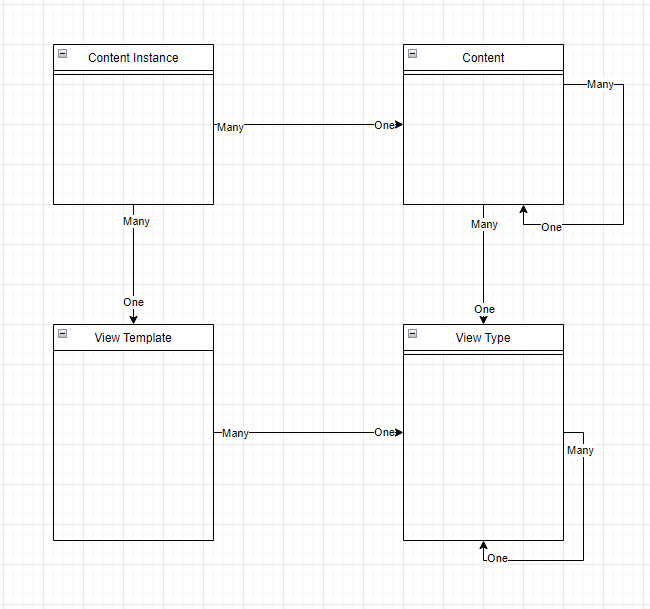

  

<h3 align="center">Open-source headless CMS, self-hosted or Cloud you’re in control.</h3>

<a href="https://dconfig.com">Cloud</a>

  
  

DConfig CMS is based on .NET 4.8 and had been written between 2011-2015, patched with some updates afterwards from time to time, published as an open source project in 2023. 
Features:
- The project is built up on JSON backend APIs, so you can do any action either from the dashboard or from the APIs.
- You can have fully seperated accounts on one instance of DConfig, and on each one you can launch one or more websites.
- DConfig allows you to write the queries you want to access the data in the database and show them in pages templates in the way you want.

You can access the CMS website on the next link:
[dconfig.com](https://dconfig.com)

## Contents
<!--ts-->
- [Contents](#contents)
- [Installation](#installation)
- [Usage](#usage)
  - [Website Manager](#website-manager)
  - [Gallery](#gallery)
  - [Membership](#membership)
  - [Forms Manager](#forms-manager)
- [Development](#development)
  - [Concepts](#concepts)
  - [SAB framework](#sab-framework)
- [Contributing](#contributing)
- [License](#license)
<!--te-->

## Installation
While DConfig is written using .NET 4 so it should be installed on a Windows server that has IIS. After building the application you will need to host DConfig project inside IIS, and connect this project to a SQL Server database. You will need to modify "SystemDatastore" in Web.config file to add your database connection string. Whenever you run DConfig it will create its database schema automatically but after that step you will need to run the file db_see.sql against that database in order to be able to access the DConfig dashboard.

Afterwards you should be able to access the dashboard using the next info:

- Path: /DConfig
- Username: dconfig
- Password: dconfig123

## Usage

### Website Manager
App for managing the contents and design of the website you want to implement. The main four concepts in website manager are:
- View Types: Where you can design the model of each content (What type of variables a content or page has). A view type can allow a specific view types as children, so your contents should follow a constrainted structue according.
- View Templates: Where you can implement the website pages views, and render the related view type fields in the right places.
- Contents: Where you define a page or some type of data will be rendered inside the parent page. A content can have another parent content so you can define your contents as a tree model.
- Content Instances: Where you define the real version of the page or data, where you can fill up the view type fields with your data and link this instance with specific view template.

The next diagram shows the relation between these 4 entities:

### Gallery
App for managing the assets, the gallery can be linked to Azure storage account to store the assets there instead of saving them in the website directory.

### Membership
App for managing users, roles and privileges to access the website pages and backend APIs.

### Forms Manager
App for managing the forms that can be added to the website pages. The app allows you to design the form with the fields you need and extend that any time even after having some submissions.

## Development

### Concepts
--will be added soon--

### SAB framework
--will be added soon--

## Contributing
You can request contributing to add more features to this platform on the next email: contribute@bcrumbs.net

## License
DConfig project is released under the [MIT License](LICENSE).
Please make sure you understand its [implications and guarantees](https://writing.kemitchell.com/2016/09/21/MIT-License-Line-by-Line.html).
